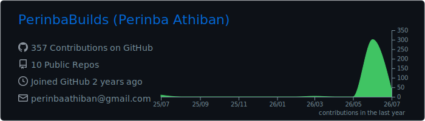
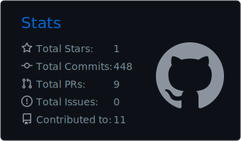
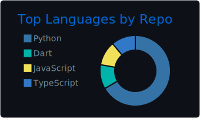

<table width="100%">
<tr>
<td width="50%" valign="middle">

# Hi 👋, I'm Perinba Athiban

**Final Year B.Tech CSE (AI & Robotics) @ VIT Chennai** 

 

💼 Ex-Data Engineer Intern @ TangoEye &nbsp;·&nbsp; 🛰️ Ex-ISRO Intern
 
📜 IEEE-published researcher &nbsp;·&nbsp; 🏆 5 patents
 
🥇 National 1st place (YOLOv8 ADAS)

💬 Ask me about data engineering, ML/DL, NLP, computer vision, or shipping AI systems to production

</td>
<td width="50%" align="center" valign="middle">

</td>
</tr>
</table>

 

## 👨‍💻 About Me

I'm an AI/ML engineer focused on shipping intelligent systems to production — from RAG and LLM-evaluation pipelines to computer-vision models and the data infrastructure, APIs, and streaming backends that serve them. Most recently at **TangoEye**, I cut production analytics query latency **up to 84×** (65s → 0.77s) with aggregation pushdown and keyset pagination, and engineered an RBAC-gated operations console managing migration/audit workflows for **6,300+ retail stores** on AWS (SQS, Glue, Lambda). My work spans **4 IEEE-indexed publications**, **5 patents** across IoT, blockchain, and embedded systems, and an ISRO internship on launch-vehicle telemetry analysis. I care about correctness, measurable performance, and systems that hold up under real-world load.

 

## 🛠️ Tech Stack

)

 

## 🎯 Skills by Role

| Role | Core Skills |
|---|---|
| ⚙️ **AI Engineer** | [FastAPI](https://fastapi.tiangolo.com/), [Docker](https://www.docker.com/), [AWS](https://aws.amazon.com/) ([EC2](https://aws.amazon.com/ec2/), [S3](https://aws.amazon.com/s3/)), [CI/CD](https://en.wikipedia.org/wiki/CI/CD), [MLOps](https://ml-ops.org/), [RESTful APIs](https://restfulapi.net/), [RAG](https://en.wikipedia.org/wiki/Retrieval-augmented_generation), [Agile/Scrum](https://www.scrumguides.org/), [Version Control](https://en.wikipedia.org/wiki/Version_control) |
| 🤖 **Machine Learning** | [scikit-learn](https://scikit-learn.org/), Anomaly Detection ([Z-Score](https://en.wikipedia.org/wiki/Standard_score), [Isolation Forest](https://en.wikipedia.org/wiki/Isolation_forest), [One-Class SVM](https://scikit-learn.org/stable/modules/outlier_detection.html)), [MLflow](https://mlflow.org/) |
| 🧠 **Deep Learning** | [TensorFlow](https://www.tensorflow.org/), [PyTorch](https://pytorch.org/), [CNNs](https://en.wikipedia.org/wiki/Convolutional_neural_network) |
| 💬 **NLP** | [RAG](https://en.wikipedia.org/wiki/Retrieval-augmented_generation), [LangChain](https://www.langchain.com/), [Hugging Face](https://huggingface.co/), [ChromaDB](https://www.trychroma.com/), [FAISS](https://github.com/facebookresearch/faiss), [sentence-transformers](https://www.sbert.net/) |
| 👁️ **Computer Vision** | [YOLOv8](https://docs.ultralytics.com/models/yolov8/), [OpenCV](https://opencv.org/), [real-time object detection](https://en.wikipedia.org/wiki/Object_detection) |
| 🔧 **Data Engineer** | [ETL/ELT pipelines](https://en.wikipedia.org/wiki/Extract,_transform,_load), [data modeling & warehousing](https://en.wikipedia.org/wiki/Data_warehouse), [data architecture](https://en.wikipedia.org/wiki/Data_architecture), [Apache Spark](https://spark.apache.org/), [Apache Kafka](https://kafka.apache.org/), AWS ([SQS](https://aws.amazon.com/sqs/), [Glue](https://aws.amazon.com/glue/), [Lambda](https://aws.amazon.com/lambda/)), query optimization (aggregation pushdown, keyset pagination), [SQL](https://en.wikipedia.org/wiki/SQL), [Data Governance](https://en.wikipedia.org/wiki/Data_governance) |
| 📊 **Data Scientist** | [Feature engineering](https://en.wikipedia.org/wiki/Feature_engineering), [statistical analysis](https://en.wikipedia.org/wiki/Statistics), [A/B testing](https://en.wikipedia.org/wiki/A/B_testing), [Python](https://www.python.org/), [scikit-learn](https://scikit-learn.org/), [MLflow](https://mlflow.org/), [Jupyter](https://jupyter.org/) |
| 🗄️ **Database Management** | [MySQL](https://www.mysql.com/), [PostgreSQL](https://www.postgresql.org/), [MongoDB](https://www.mongodb.com/), [SQLite3](https://www.sqlite.org/), [CRUD operations](https://en.wikipedia.org/wiki/Create,_read,_update_and_delete), [schema design](https://en.wikipedia.org/wiki/Database_design), [OLAP/OLTP](https://en.wikipedia.org/wiki/Online_analytical_processing) |
| 💻 **Software Engineer** | [Java](https://www.java.com/), [C++](https://isocpp.org/), [Data Structures & Algorithms](https://en.wikipedia.org/wiki/Data_structure), [OOP](https://en.wikipedia.org/wiki/Object-oriented_programming), [Git](https://git-scm.com/), [Docker](https://www.docker.com/), [REST APIs](https://restfulapi.net/), [Flutter](https://flutter.dev/) |

 

## 💼 Experience

| Role | Highlights |
|---|---|
| **Data Engineer Intern** · [TangoEye.ai](https://tangoeye.ai/)   Jun 2026 – Jul 2026 · Chennai, India | Built **TangoOps**, an access-controlled console managing migration/audit workflows for **6,321 stores** across 4 role-gated accounts, replacing direct-AWS shell scripts with atomic, RBAC-gated operations. Reduced production analytics query latency **up to 84× (65s → 0.77s)** via aggregation pushdown and keyset pagination, decoupled a migration pipeline with SQS, and automated a 5-phase incident fix into one idempotent AWS Glue job with SES/CloudWatch alerting. |
| **Project Intern** · ISRO – Satish Dhawan Space Centre   Jun 2025 – Jul 2025 · Sriharikota, India | Built a Python telemetry app (SQLite3 backend, Tkinter/Matplotlib GUI) for real-time curve visualization and nominal-vs-actual comparison, and integrated an ML anomaly-detection pipeline (Z-Score, Isolation Forest, One-Class SVM) with severity scoring and structured CSV export for post-flight review. |

 

## 🚀 Featured Projects

| Project | Description | Stack | Links |
|---|---|---|---|
| **EvalPipe — AI Evaluation Pipeline** | Self-hosted, provider-agnostic evaluation pipeline for LLM apps — pluggable metric suite, statistically rigorous A/B testing, and prompt versioning; 95% test coverage, runs fully offline | Python, FastAPI, Docker | [Code](https://github.com/PerinbaBuilds/AI-Evaluation-Pipeline) · [Demo](https://evalpipe.onrender.com/) |
| **Semantic-RAG-Search** | RAG pipeline over 18,000+ Usenet posts (1993) — sentence-transformer embeddings in ChromaDB, LangGraph query rewriting + document grading, a Fuzzy C-Means semantic cache (~15× cheaper lookups), and RAGAS evaluation | Python, LangGraph, ChromaDB, FastAPI | [Code](https://github.com/PerinbaBuilds/Semantic-RAG-Search) · [Demo](https://perinbabuilds-newsgroups-search.hf.space/) |
| **TaskPilot** | RL (Q-learning) cloud job scheduler that minimises carbon footprint via tier-pool routing and real-time grid-energy data, with LLM-generated explainability for each scheduling decision | Python, Groq, FastAPI | [Code](https://github.com/PerinbaBuilds/TaskPilot) · [Demo](https://taskpilot-krt8.onrender.com/) |
| **Curve-Analysis-and-Anomaly-Detection** | Desktop tool for launch vehicle telemetry analysis — deviation/bound checks and ML-based anomaly detection. Built at SDSC-SHAR, ISRO | Python, scikit-learn | [Code](https://github.com/PerinbaBuilds/Curve-Analysis-and-Anomaly-Detection) |
| **BloodBank-Finder** | Real-time blood donation and emergency-response platform — geo-matched donor discovery, live inventory, and ambulance dispatch | Next.js, TypeScript, Prisma, Socket.io, React Native | [Code](https://github.com/PerinbaBuilds/BloodBank-Finder) · [Demo](https://blood-bank-finder.vercel.app/) |
| **Finance-App** | Cross-platform personal finance tracker — per-category budgets, income/expense logging, savings goals, recurring bills, a financial-health score, and an **AI financial advisor** (Grok / xAI) that turns spending patterns into personalized guidance | Flutter, Supabase, Grok (xAI) | [Code](https://github.com/PerinbaBuilds/Finance-App) · [Demo](https://perinbabuilds.github.io/Finance-App/) |
| **Smart-Traffic-System** | IoT traffic-signal system that detects approaching emergency vehicles via GPS + siren telemetry and opens a real-time green corridor through intersections ahead of them | React, Node.js, Socket.io, Leaflet, Vite | [Code](https://github.com/PerinbaBuilds/Smart-Traffic-System) · [Demo](https://perinbabuilds.github.io/Smart-Traffic-System/) |

 

## 📜 Publications, Patents & Awards

| | |
|---|---|
| **Research** | 4 IEEE-indexed publications across computer vision, predictive analytics, satellite EPS, and maritime safety systems |
| **Patents** | 5 patents (1 recently published) spanning IoT sensing, blockchain-based EHR systems, and embedded design |
| **Award** | 1st Place, 39th National Convention of Electrical Engineers (2024) — Vehicle Distance Estimation using YOLOv8, from 85+ national submissions |

 

## 📊 GitHub Dashboard

 

---

###  Thanks for stopping by!

*Explore the projects above, check out the dashboard, or reach out — always happy to talk AI, ML, or anything in between.* 

